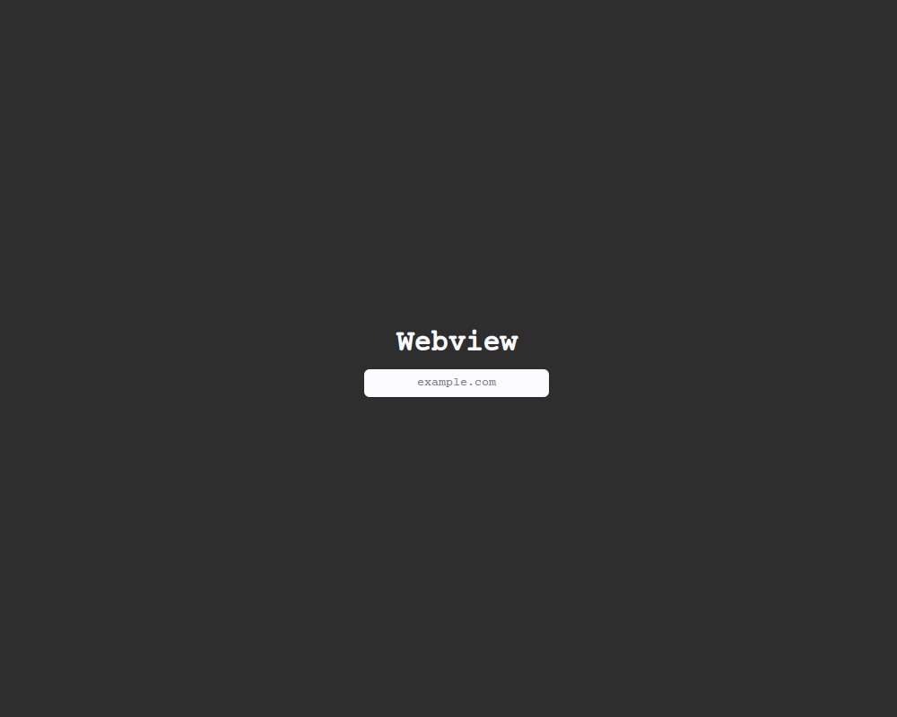

# Webview

## Dev stack
* Node.js
* Electron

## Shortcuts
* [ Ctrl + E ] &nbsp;&nbsp;&nbsp;&nbsp; Exit
* [ Ctrl + Z ] &nbsp;&nbsp;&nbsp;&nbsp; Navigate back
* [ Ctrl + Y ] &nbsp;&nbsp;&nbsp;&nbsp; Navigate forward
* [ Ctrl + R ] &nbsp;&nbsp;&nbsp;&nbsp; Reload current page
* [ Ctrl + H ] &nbsp;&nbsp;&nbsp;&nbsp; Navigate to home page


## How to run
```
npm run start
```
## How to pack
```
npm run make
```


